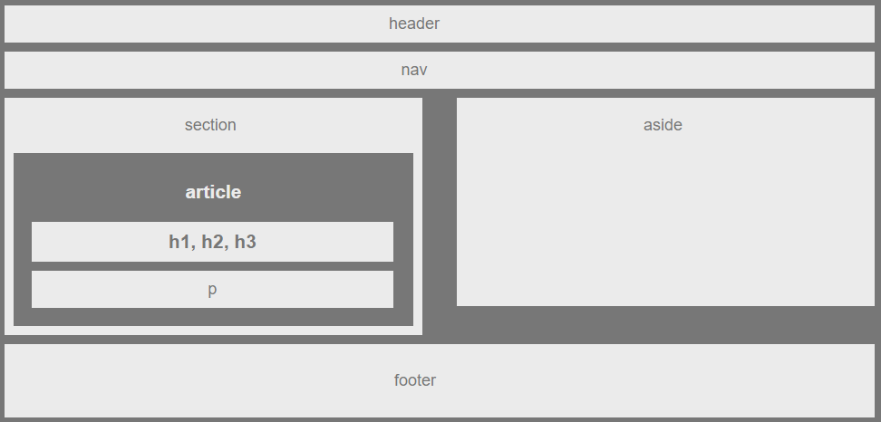

<!-- Put the name of the project after the # -->
<!-- the # means h1  -->
# HW-Wireframe

<!-- Put a description of what the project is -->
Learn html, css, floats, box model

# Link to deployed site
<!-- make a link to the deployed site --> 
<!-- [What the user will see](the link to the deployed site) -->
[hw-wireframe](https://fruit13ok.github.io/HW-Wireframe/)

# Images
<!-- take a picture of the image and add it into the readme  -->
<!--  -->
<!--  -->


# technology used
<!-- make a list of technology used -->
<!-- what you used for this web app, like html css -->

<!-- 
1. First ordered list item
2. Another item
⋅⋅* Unordered sub-list. 
1. Actual numbers don't matter, just that it's a number
⋅⋅1. Ordered sub-list
4. And another item. 
-->
- HTML
- CSS

# code snippets
<!-- put snippets of code inside ``` ``` so it will look like code -->
<!-- if you want to put blockquotes use a > -->

```
.clearfix::after {
    content: "";
    display:block;
    clear: both;
}
```
> clearfix clears the float after this element


# Learning points
<!-- Learning points where you would write what you thought was helpful -->
To style HTML, mainly about hoe to **_float_**

# Author 
<!-- make a link to the deployed site and have your name as the link -->
Yi Liu

# License
Standard MIT License
